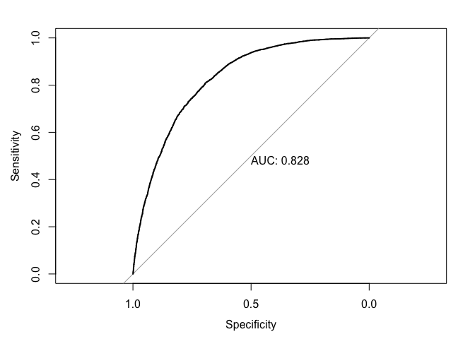

Classifying Diabetes Draft 2
================
Luke Fisher
16 February, 2025

## Introduction

Diabetes is an chronic autoimmune disease affecting millions of
Americans each year. It is best described as the body’s inability to
properly produce insulin, or produce any at all. This is a result of
either an invalid or exhausted pancreas, whose job is to secrete enough
insulin to manage blood-glucose levels. Normally, insulin is released to
enable cells to absorb the blood-glucose to use for energy. In this way,
it acts as a “key” between blood-glucose and cells.

For a diabetic, however, this “key” doesn’t occur naturally, instead
taking the form of insulin injections. As such, a diabetic uses a
glucose monitor to regulate their blood sugar–whose excess or lack
thereof has detrimental consequences. For this reason, it is important
to know whether or not someone is diabetic. In this project, I will use
classification to identify diabetes.

## Data Collection

The classification will be based on a Kaggle dataset derived from the
CDCs Behavioral Risk Factor Surveillance System (BRFSS). The data
contains 70,692 responses from the 2015 BRFSS survey, each related to
risk factors like smoking, high cholesterol, and physical activity.
Furthermore, the data contains an equal 50-50 split of respondents with
and without diabetes.

The data is binary, meaning that the predictors take on a value one or
zero depending on whether the condition is true or not. For instance, if
a respondent has a smoking habit they will be marked with a 1 for the
smoking column; otherwise, they will receive a 0. There are some
exceptions to this like BMI and age, where the values are continuous.

## Methodology

The classification will be done by binary logistic regression. As such,
the response variable, diabetes, will take on two values, “yes” or “no”,
corresponding to whether the patient has the disease. The classification
will start with a series of logistic models, each with increasing
complexity. The models will be merged into a list where each of them
will be applied to a predictive function with a 0.5 threshold. The
function will label, respectively, “yes” and “no” for the values above
and below 0.5. Afterwards, these predicted values will be compared with
the actual values in a table and put into a confusion matrix for
evaluation. The method above will repeat itself with one large model
with multiple cutoffs. The point of this is to ensure consistent
results.

``` r
library(dplyr)
```

    ## 
    ## Attaching package: 'dplyr'

    ## The following objects are masked from 'package:stats':
    ## 
    ##     filter, lag

    ## The following objects are masked from 'package:base':
    ## 
    ##     intersect, setdiff, setequal, union

``` r
library(ggplot2)
library(ISLR)
library(tibble)
library(caret)
```

    ## Loading required package: lattice

``` r
library(tidyr)
library(skimr)
```

## Load in data

``` r
diabetesData <- read.csv('/Users/lukefisher/Desktop/Coding/repos/Health_Analytics/Data/Diabetes_Indicators_Binary.csv')
```

## Data Wrangling

``` r
diabetesData <- diabetesData %>% 
rename(Diabetes = Diabetes_binary) %>%
mutate(Diabetes = factor(Diabetes, levels = c(0, 1), labels = c("no", "yes")))

str(diabetesData)
```

    ## 'data.frame':    70692 obs. of  22 variables:
    ##  $ Diabetes            : Factor w/ 2 levels "no","yes": 1 1 1 1 1 1 1 1 1 1 ...
    ##  $ HighBP              : num  1 1 0 1 0 0 0 0 0 0 ...
    ##  $ HighChol            : num  0 1 0 1 0 0 1 0 0 0 ...
    ##  $ CholCheck           : num  1 1 1 1 1 1 1 1 1 1 ...
    ##  $ BMI                 : num  26 26 26 28 29 18 26 31 32 27 ...
    ##  $ Smoker              : num  0 1 0 1 1 0 1 1 0 1 ...
    ##  $ Stroke              : num  0 1 0 0 0 0 0 0 0 0 ...
    ##  $ HeartDiseaseorAttack: num  0 0 0 0 0 0 0 0 0 0 ...
    ##  $ PhysActivity        : num  1 0 1 1 1 1 1 0 1 0 ...
    ##  $ Fruits              : num  0 1 1 1 1 1 1 1 1 1 ...
    ##  $ Veggies             : num  1 0 1 1 1 1 1 1 1 1 ...
    ##  $ HvyAlcoholConsump   : num  0 0 0 0 0 0 1 0 0 0 ...
    ##  $ AnyHealthcare       : num  1 1 1 1 1 0 1 1 1 1 ...
    ##  $ NoDocbcCost         : num  0 0 0 0 0 0 0 0 0 0 ...
    ##  $ GenHlth             : num  3 3 1 3 2 2 1 4 3 3 ...
    ##  $ MentHlth            : num  5 0 0 0 0 7 0 0 0 0 ...
    ##  $ PhysHlth            : num  30 0 10 3 0 0 0 0 0 6 ...
    ##  $ DiffWalk            : num  0 0 0 0 0 0 0 0 0 0 ...
    ##  $ Sex                 : num  1 1 1 1 0 0 1 1 0 1 ...
    ##  $ Age                 : num  4 12 13 11 8 1 13 6 3 6 ...
    ##  $ Education           : num  6 6 6 6 5 4 5 4 6 4 ...
    ##  $ Income              : num  8 8 8 8 8 7 6 3 8 4 ...

## Cross validation

``` r
# Split the data into an 80/20 train vs. test split. Set the seed for replicability.
set.seed(44222)

diabetesIdx = sample((nrow(diabetesData)), size = 0.8 * nrow(diabetesData))
diabetesTrn = diabetesData[diabetesIdx, ]
diabetesTst = diabetesData[-diabetesIdx, ]

head(diabetesTrn, n = 10)
```

    ##       Diabetes HighBP HighChol CholCheck BMI Smoker Stroke HeartDiseaseorAttack
    ## 36027      yes      0        0         1  32      0      0                    0
    ## 32605       no      1        0         1  29      1      0                    1
    ## 67519      yes      1        0         1  30      1      1                    0
    ## 41322      yes      1        0         1  24      1      0                    0
    ## 54098      yes      1        1         1  28      1      1                    1
    ## 34711       no      0        0         1  26      1      0                    0
    ## 27963       no      0        0         1  36      1      0                    0
    ## 12132       no      0        0         1  28      1      0                    0
    ## 11078       no      0        0         0  22      0      0                    0
    ## 38966      yes      1        0         1  44      0      0                    0
    ##       PhysActivity Fruits Veggies HvyAlcoholConsump AnyHealthcare NoDocbcCost
    ## 36027            1      1       1                 0             1           0
    ## 32605            1      0       1                 0             1           0
    ## 67519            1      0       1                 0             1           0
    ## 41322            1      1       1                 0             1           0
    ## 54098            1      1       1                 0             1           0
    ## 34711            1      1       1                 0             0           0
    ## 27963            1      0       1                 0             1           0
    ## 12132            1      1       1                 0             1           0
    ## 11078            1      1       1                 0             0           1
    ## 38966            1      1       1                 0             1           0
    ##       GenHlth MentHlth PhysHlth DiffWalk Sex Age Education Income
    ## 36027       3        0        0        0   1  11         5      7
    ## 32605       5        0       28        1   1   9         4      6
    ## 67519       5        0       30        1   1   8         6      7
    ## 41322       2        0        0        0   1   9         4      3
    ## 54098       4        0        0        0   0  13         5      6
    ## 34711       3        0        0        0   0   3         4      3
    ## 27963       3        0        2        0   1   6         5      8
    ## 12132       2        0        0        1   0   8         5      4
    ## 11078       1        0        0        0   1   6         4      3
    ## 38966       3        2        1        1   0   8         3      3

``` r
get_logistic_pred = function(mod, data, res = "y", pos = 1, neg = 0, cut = 0.5) {
  probs = predict(mod, newdata = data, type = "response")
  ifelse(probs > cut, pos, neg)
}

# Creating separate predictions based on different cutoffs

lrgModel = glm(Diabetes ~ ., data = diabetesTrn, family = "binomial")

testPred_01 = get_logistic_pred(lrgModel, diabetesTst, res = "Diabetes", 
pos = "yes", neg = "no", cut = 0.1)

testPred_02 = get_logistic_pred(lrgModel, diabetesTst, res = "Diabetes", 
pos = "yes", neg = "no", cut = 0.33)

testPred_03 = get_logistic_pred(lrgModel, diabetesTst, res = "Diabetes", 
pos = "yes", neg = "no", cut = 0.5)

testPred_04 = get_logistic_pred(lrgModel, diabetesTst, res = "Diabetes", 
pos = "yes", neg = "no", cut = 0.66)

testPred_05 = get_logistic_pred(lrgModel, diabetesTst, res = "Diabetes", 
pos = "yes", neg = "no", cut = 0.9)


# Evaluate Accuaracy, Sensitivity, and Specificity for each cutoff
testTab_01 <- table(predicted = testPred_01, actual = diabetesTst$Diabetes)
testTab_02 <- table(predicted = testPred_02, actual = diabetesTst$Diabetes)
testTab_03 <- table(predicted = testPred_03, actual = diabetesTst$Diabetes)
testTab_04 <- table(predicted = testPred_04, actual = diabetesTst$Diabetes)
testTab_05 <- table(predicted = testPred_05, actual = diabetesTst$Diabetes)


testMatrx_01 <- confusionMatrix(testTab_01, positive = "yes")
testMatrx_02 <- confusionMatrix(testTab_02, positive = "yes")
testMatrx_03 <- confusionMatrix(testTab_03, positive = "yes")
testMatrx_04 <- confusionMatrix(testTab_04, positive = "yes")
testMatrx_05 <- confusionMatrix(testTab_05, positive = "yes")


metrics <- rbind(
  c(testMatrx_01$overall["Accuracy"],
    testMatrx_01$byClass["Sensitivity"],
    testMatrx_01$byClass["Specificity"]),

  c(testMatrx_02$overall["Accuracy"],
    testMatrx_02$byClass["Sensitivity"],
    testMatrx_02$byClass["Specificity"]),

  c(testMatrx_03$overall["Accuracy"],
    testMatrx_03$byClass["Sensitivity"],
    testMatrx_03$byClass["Specificity"]),
    
  c(testMatrx_04$overall["Accuracy"],
    testMatrx_04$byClass["Sensitivity"],
    testMatrx_04$byClass["Specificity"]),

  c(testMatrx_05$overall["Accuracy"],
    testMatrx_05$byClass["Sensitivity"],
    testMatrx_05$byClass["Specificity"])
)

rownames(metrics) = c("c = 0.10", "c = 0.33", "c = 0.50", "c = 0.66", "c = 0.90")

metrics_tibble <- as_tibble(metrics, rownames = "Threshold")

print(knitr::kable(metrics_tibble))
```

    ## 
    ## 
    ## |Threshold |  Accuracy| Sensitivity| Specificity|
    ## |:---------|---------:|-----------:|-----------:|
    ## |c = 0.10  | 0.5932527|   0.9930388|   0.1969014|
    ## |c = 0.33  | 0.7356249|   0.9041057|   0.5685915|
    ## |c = 0.50  | 0.7483556|   0.7675806|   0.7292958|
    ## |c = 0.66  | 0.7161044|   0.5726666|   0.8583099|
    ## |c = 0.90  | 0.5513120|   0.1128001|   0.9860563|

``` r
library(pROC)
```

    ## Type 'citation("pROC")' for a citation.

    ## 
    ## Attaching package: 'pROC'

    ## The following objects are masked from 'package:stats':
    ## 
    ##     cov, smooth, var

``` r
testProb = predict(lrgModel, newdata = diabetesTst, type = "response")
testRoc = roc(diabetesTst$Diabetes ~ testProb, plot = TRUE, print.auc = TRUE)
```

    ## Setting levels: control = no, case = yes

    ## Setting direction: controls < cases

<!-- -->

## Test errors

``` r
# Test for error in the 0.5 prediction
calcErr = function(actual, predicted) {
  mean(actual != predicted)
}

calcErr(actual = diabetesTst$Diabetes, predicted = testPred_03)
```

    ## [1] 0.2516444

The table above contains regression models with varying cutoffs. The
model with a 0.5 cutoff appears to have the most balanced trade-off
between Accuracy, Specificity, and Sensitivity, exhibiting
characteristics of a valid classifier. Furthermore, the ideal values for
Sensitivity and Specificity align with the values for the 0.5 model as
seen the ROC curve.

Its error of 0.25, however, is too high of an error to be acceptable in
diagnosing diabetes. Such an error could be the difference between an
insulin-receiving diabetic or a hyperglycemic diabetic–the latter of
which can face severe health consequences.

Therefore, we must alter the complexity of the previous 0.5 model to
obtain an acceptable error value. It is also important that we eliminate
the possibility of over-fitting, as this can occur with highly complex
models like `lrgModel`.

To address this, we must compare the train and test errors of
`testPred_03`. If the test errors are significantly higher than the
train errors, we can conclude over-fitting. Otherwise, we can rule out
over-fitting and work to reduce the error to an acceptable level.

## Comparing test and train data to test over-fitting.

``` r
trainPred_03 = get_logistic_pred(lrgModel, diabetesTrn, res = "Diabetes", 
pos = "yes", neg = "no", cut = 0.5)

# Predict on the training data
trainErr_03 = calcErr(actual = diabetesTrn$Diabetes, predicted = trainPred_03)

# Calculate test error (already done in your code)
testErr_03 = calcErr(actual = diabetesTst$Diabetes, predicted = testPred_03)

# Compare train and test errors
errorComparison = tibble::tibble(
  Type = c("Train Error", "Test Error"),
  Error = c(trainErr_03, testErr_03)
)

print(knitr::kable(errorComparison))
```

    ## 
    ## 
    ## |Type        |     Error|
    ## |:-----------|---------:|
    ## |Train Error | 0.2518346|
    ## |Test Error  | 0.2516444|

**To summarise: the above model exhibits x error, making y condition
true. Therefore, we can conclude y qualities for the classification
model**

## Evaluate

**Address the tendency for the model to overfit**

The above model exhibits different levels of Accuracy, Sensitivity, and
Specificity at different cutoffs. This implies a change the amount of
positive and negative cases captured, (i.e., 1 for positive, 0 for
negative) meaning that the values for Accuracy, Specificity, and
Sensitivity are a direct reflection of however many positive and
negative cases there are. For example, it is no surprise that the first
model captures 99 percent of true positives under a 0.10 cutoff. It
practically only captures positive cases. The inverse is true for the
last model.

With that said, the model with the most balanced trade-off between
Accuracy, Sensitivity, and Specificity is the model with a 0.5 cutoff.
It differs from the other models in the sense that it doesn’t skew
toward one metric, making for a unbiased classifier. Furthermore, the
ROC curve hugs the top-left around the 0.50 mark, where the model
exhibits its highest true positive and negative rates. The overall
performance of the model is 0.82, meaning that it has a solid ability to
discriminate between diabetics and non-diabetics.

## Conclusion
