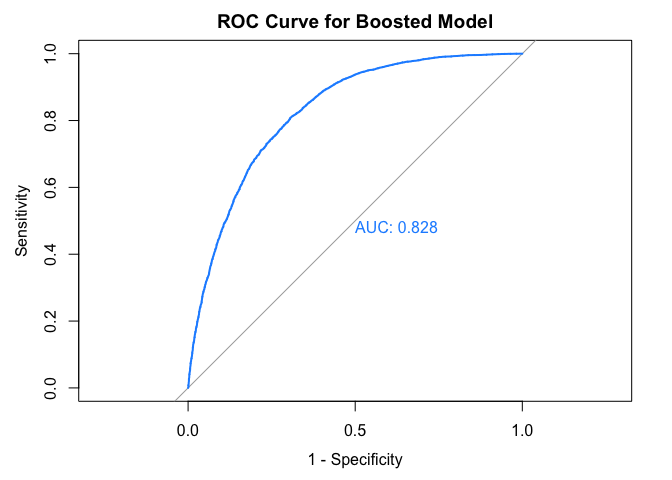
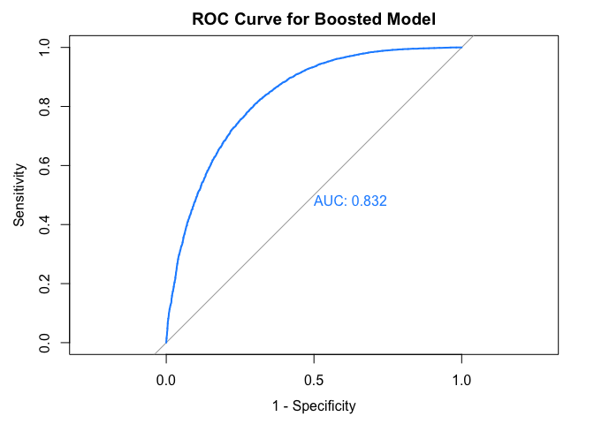

Data Analysis
================
Luke Fisher
24 March, 2025

## Introduction

Diabetes is an chronic autoimmune disease affecting millions of
Americans each year. It is best described as the body’s inability to
properly produce insulin, or produce any at all. This is a result of
either an invalid or exhausted pancreas, whose job is to secrete enough
insulin to manage blood-glucose levels. Normally, insulin is released to
enable cells to absorb the blood-glucose to use for energy. In this way,
it acts as a “key” between blood-glucose and cells.

For a diabetic, however, this “key” doesn’t occur naturally, instead
taking the form of insulin injections. As such, a diabetic uses a
glucose monitor to regulate their blood sugar–whose excess or lack
thereof has detrimental consequences. For this reason, it is important
to know whether or not someone is diabetic. In this project, I will use
classification to identify diabetes.

## Data Collection

The classification will be based on a dataset from the CDCs Behavioral
Risk Factor Surveillance System (BRFSS). The data contains 70,692
responses from the 2015 BRFSS survey, each related to risk factors like
smoking, high cholesterol, and physical activity. Furthermore, the data
contains an equal 50-50 split of respondents with and without diabetes.

The data is binary, meaning that the predictors take on a value one or
zero depending on whether the condition is true or not. For instance, if
a respondent has a smoking habit they will be marked with a 1 for the
smoking column; otherwise, they will receive a 0. There are some
exceptions to this like BMI and age, where the values are continuous.

## Methodology

The classification will be done by binary logistic regression. As such,
the response variable, Diabetes, will take on two values, “yes” or “no”,
corresponding to whether the patient has the disease. The classification
will start with a series of logistic models, each with a unique cutoff.
The function will label, respectively, “yes” and “no” for instances of
Diabetes above or below a given cutoff. Afterwards, these predicted
values will be compared with the actual values in a table and put into a
confusion matrix for evaluation. The goal is to isolate and optimize one
model for classification. As such, modifications to this model will be
taken if the it exhibits unacceptable metrics.

    ## 
    ## Attaching package: 'dplyr'

    ## The following objects are masked from 'package:stats':
    ## 
    ##     filter, lag

    ## The following objects are masked from 'package:base':
    ## 
    ##     intersect, setdiff, setequal, union

    ## Loading required package: lattice

    ## Loading required package: Matrix

    ## 
    ## Attaching package: 'Matrix'

    ## The following objects are masked from 'package:tidyr':
    ## 
    ##     expand, pack, unpack

    ## Loaded glmnet 4.1-8

    ## Warning: package 'car' was built under R version 4.3.3

    ## Loading required package: carData

    ## 
    ## Attaching package: 'car'

    ## The following object is masked from 'package:dplyr':
    ## 
    ##     recode

    ## Warning: package 'xgboost' was built under R version 4.3.3

    ## 
    ## Attaching package: 'xgboost'

    ## The following object is masked from 'package:dplyr':
    ## 
    ##     slice

    ## Type 'citation("pROC")' for a citation.

    ## 
    ## Attaching package: 'pROC'

    ## The following objects are masked from 'package:stats':
    ## 
    ##     cov, smooth, var

## Data Wrangling

    ##       Diabetes HighBP HighChol CholCheck BMI Smoker Stroke HeartDiseaseorAttack
    ## 36027      yes      0        0         1  32      0      0                    0
    ## 32605       no      1        0         1  29      1      0                    1
    ## 67519      yes      1        0         1  30      1      1                    0
    ## 41322      yes      1        0         1  24      1      0                    0
    ## 54098      yes      1        1         1  28      1      1                    1
    ## 34711       no      0        0         1  26      1      0                    0
    ## 27963       no      0        0         1  36      1      0                    0
    ## 12132       no      0        0         1  28      1      0                    0
    ## 11078       no      0        0         0  22      0      0                    0
    ## 38966      yes      1        0         1  44      0      0                    0
    ##       PhysActivity Fruits Veggies HvyAlcoholConsump AnyHealthcare NoDocbcCost
    ## 36027            1      1       1                 0             1           0
    ## 32605            1      0       1                 0             1           0
    ## 67519            1      0       1                 0             1           0
    ## 41322            1      1       1                 0             1           0
    ## 54098            1      1       1                 0             1           0
    ## 34711            1      1       1                 0             0           0
    ## 27963            1      0       1                 0             1           0
    ## 12132            1      1       1                 0             1           0
    ## 11078            1      1       1                 0             0           1
    ## 38966            1      1       1                 0             1           0
    ##       GenHlth MentHlth PhysHlth DiffWalk Sex Age Education Income
    ## 36027       3        0        0        0   1  11         5      7
    ## 32605       5        0       28        1   1   9         4      6
    ## 67519       5        0       30        1   1   8         6      7
    ## 41322       2        0        0        0   1   9         4      3
    ## 54098       4        0        0        0   0  13         5      6
    ## 34711       3        0        0        0   0   3         4      3
    ## 27963       3        0        2        0   1   6         5      8
    ## 12132       2        0        0        1   0   8         5      4
    ## 11078       1        0        0        0   1   6         4      3
    ## 38966       3        2        1        1   0   8         3      3

## Building classifiers

| Threshold |  Accuracy | Sensitivity | Specificity |
|:----------|----------:|------------:|------------:|
| c = 0.10  | 0.5932527 |   0.9930388 |   0.1969014 |
| c = 0.33  | 0.7356249 |   0.9041057 |   0.5685915 |
| c = 0.50  | 0.7483556 |   0.7675806 |   0.7292958 |
| c = 0.66  | 0.7161044 |   0.5726666 |   0.8583099 |
| c = 0.90  | 0.5513120 |   0.1128001 |   0.9860563 |

The table above contains regression models with varying cutoffs. The
model with a 0.5 cutoff appears to have the most balanced trade-off
between Accuracy, Specificity, and Sensitivity, exhibiting
characteristics of a valid classifier.

## Test errors

    ## [1] 0.2516444

## Comparing test and train errors of the logistic model.

| Type        |     Error |
|:------------|----------:|
| Train Error | 0.2518346 |
| Test Error  | 0.2516444 |

## Calculating RMSE for the logistic model.

| Type       |      RMSE |
|:-----------|----------:|
| Train RMSE | 0.5018312 |
| Test RMSE  | 0.5016417 |

The error values above are too high for classifying diabetes. Sitting at
a rate of 0.25, both errors carry harmful consequences, specifically the
testing set. If 0.25 percent of predictions are incorrect, then
misdiagnosis will occur and people won’t get the treatment that they
need. The RMSE values reaffirm this issue at a staggering 0.50 for each.
This implies that the predicted values are, on average, 0.5 units away
from the actual values.

With high error and RMSE values, the initial model must be modified such
that it reflects better accuracy. This will be done by isolating
significant predictors and plugging them into a boosting model.

    ## Setting levels: control = 0, case = 1

    ## Setting direction: controls < cases

<!-- -->

## Significance testing

*Create coefficient plot?*

|                      |   Estimate | Std. Error |     z value | Pr(\>\|z\|) |
|:---------------------|-----------:|-----------:|------------:|------------:|
| (Intercept)          | -6.8482299 |  0.1389907 | -49.2711376 |   0.0000000 |
| HighBP               |  0.7420328 |  0.0220466 |  33.6575227 |   0.0000000 |
| HighChol             |  0.5838587 |  0.0210585 |  27.7256017 |   0.0000000 |
| CholCheck            |  1.3477969 |  0.0912931 |  14.7633983 |   0.0000000 |
| BMI                  |  0.0754391 |  0.0017637 |  42.7740408 |   0.0000000 |
| Smoker               |  0.0038118 |  0.0210863 |   0.1807712 |   0.8565472 |
| Stroke               |  0.1933263 |  0.0458602 |   4.2155562 |   0.0000249 |
| HeartDiseaseorAttack |  0.2513817 |  0.0316545 |   7.9414212 |   0.0000000 |
| PhysActivity         | -0.0243045 |  0.0238038 |  -1.0210322 |   0.3072392 |
| Fruits               | -0.0577295 |  0.0218803 |  -2.6384265 |   0.0083292 |
| Veggies              | -0.0445863 |  0.0260545 |  -1.7112709 |   0.0870311 |
| HvyAlcoholConsump    | -0.7332077 |  0.0539896 | -13.5805303 |   0.0000000 |
| AnyHealthcare        |  0.0381443 |  0.0527735 |   0.7227938 |   0.4698066 |
| NoDocbcCost          |  0.0304985 |  0.0380442 |   0.8016583 |   0.4227507 |
| GenHlth              |  0.5796055 |  0.0127947 |  45.3004758 |   0.0000000 |
| MentHlth             | -0.0040392 |  0.0014334 |  -2.8179099 |   0.0048337 |
| PhysHlth             | -0.0083631 |  0.0013315 |  -6.2809966 |   0.0000000 |
| DiffWalk             |  0.1250893 |  0.0289458 |   4.3215062 |   0.0000155 |
| Sex                  |  0.2632854 |  0.0214026 |  12.3015753 |   0.0000000 |
| Age                  |  0.1506930 |  0.0043579 |  34.5795388 |   0.0000000 |
| Education            | -0.0293567 |  0.0114374 |  -2.5667216 |   0.0102665 |
| Income               | -0.0586832 |  0.0058000 | -10.1178662 |   0.0000000 |

We can deduce `BMI`, `GenHlth`, `Age`, `HighBP`, and `HighChol` as the
most significant predictors in the initial model. As such, we will add
these predictors to the initial model, `lrgModel`, along with more
complexity.

## Data prep

## Using a boosting model to reduce underfitting in the model

## Evaluating error from boost model

| Type        |     Error |
|:------------|----------:|
| Train Error | 0.2305802 |
| Test Error  | 0.2467643 |

## Calculate RMSE.

| Type       |      RMSE |
|:-----------|----------:|
| Train RMSE | 0.3956497 |
| Test RMSE  | 0.4077824 |

| Model    |  Accuracy | Sensitivity | Specificity |
|:---------|----------:|------------:|------------:|
| Standard | 0.7483556 |   0.7675806 |   0.7292958 |
| Boost    | 0.7532357 |   0.7931524 |   0.7136620 |

    ## Setting levels: control = 0, case = 1

    ## Setting direction: controls < cases

<!-- -->

**Continue with this section**

As we can see from the comparison, the boost model delivers better
results compared to the previous model.

The errors above, in comparison to the previous model, are not too
different. However, the training error is slightly lower than the
testing error in the boosting model, suggesting more complexity and
better accuracy without over-fitting. This figures as the errors are
close in value, indicating the model’s ability to generalize on the test
data–that is, predict well on unseen data, not just the data it was
trained on.

The RMSE values likewise reflect this generalization ability with train
and test values, respectively, as 0.39 and 0.40. Not only this, but the
values are an improvement from the previous RMSE values of 0.50 each.
Furthermore, the improved generalization is evident in the confusion
matrix above, with both accuracy and sensitivity rising.

## Evaluate

**Hammer in the importance of RMSE and why it should be lowered. Ignore
the errors. Add in ROC curve for both models?**

Two models were used to classify Diabetes, a logistic and xgboost model.
For the logistic method, models with multiple cutoffs were used to
identify the most accurate one, with the 0.5 cutoff yielding the best
results. The model exhibited the most balanced trade off between
Accuracy, Sensitivity, and Specificity, with the values, respectively,
of 0.74, 0.76, 0.72. This indicated that the model was able to identify
instances of diabetes with 74 percent Accuracy, with true positives and
negatives sitting at 76 and 72 percent, respectively. To ensure that
these metrics were not the result of under or over-fitting, the test and
train error were compared. With both values sitting around 0.25, there
was little reason to suspect a poor fit model, as such a case would
involve a large gap between the errors. The same can be said about the
train and test RMSE, which both sat around 0.5. Here, however, it was
apparent that the RMSE values were too high. The predicted values were,
on average, 0.5 units away from the actual values, which is significant
when the range of predicted probabilities is 0 and 1. Thus, it was
important to address this issue by reducing the residuals in the model.

This can be done through a gradient boost model using xgboost. In this
model, “weak learners”, or stumps from a decision tree, are aggregated
in an ensemble model. The residuals from this model are then scaled by a
learning rate and fitted to a new model, sequentially reducing error.
This ensures error is reduced without over-fitting. The effects of the
xgboost model are evident in the RMSE values, with the train and test
RMSE, respectively, sitting at 0.39 and 0.40, down from 0.50 in the
logistic model. Additionally, train and test errors sit at 0.23 and
0.24, respectively, slightly lower than 0.25. This improvement in
accuracy is reaffirmed by the comparison in performance metrics, with
the boost model leading in all but one category.

## Conclusion

The plan above is to isolate the most significant predictors in the
initial model by measuring their p-values. The predictors with the
lowest p-values (i.e., p-value \<0.05) are added to matrices for the
boosting model. This ensures that the most significant predictors are
used, and the test error in the boosting model is lowered from its
initial value. After, we want to ensure that over-fitting is not present
by calculating the RMSE for the boosting model.
